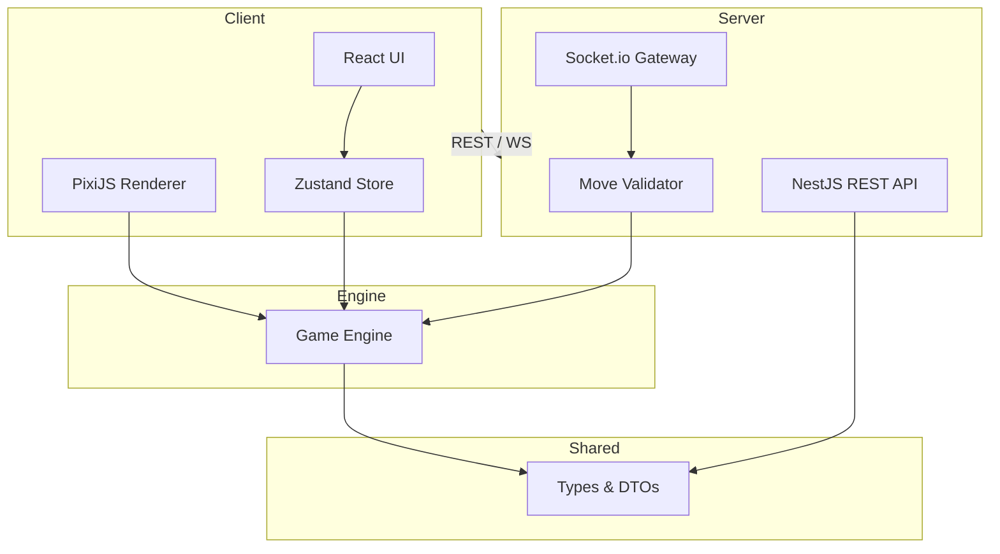

# Architecture

## Overview

Three Towers Solitaire is a monorepo web game built with Clean Architecture principles. The game engine is completely decoupled from React and the server, making it reusable across client, server validation, and AI opponents.

## Monorepo Structure

```
three-towers-solitaire/
├── apps/
│   ├── client/          # React 19 + Vite + TailwindCSS (UI)
│   ├── server/          # NestJS API + WebSocket (future)
│   └── game-engine/     # Pure TypeScript game logic (no React)
├── packages/
│   └── shared/          # Shared types, constants, DTOs
├── docker/              # Docker Compose & production images (Milestone 14)
│   ├── docker-compose.yml      # Full stack (client, server, postgres, redis)
│   ├── docker-compose.dev.yml  # PostgreSQL only for local dev
│   ├── server.Dockerfile
│   └── client.Dockerfile
├── docs/                # Documentation
└── scripts/             # Build & utility scripts
```

## Layer Separation



## Key Principles

1. **Game logic never depends on React** — all rules live in `apps/game-engine`.
2. **Server is authoritative** — clients send moves; server validates and broadcasts state.
3. **Deterministic decks** — server sends a seed; all clients generate the same shuffle.
4. **Shared types** — `Card`, `GameState`, `Move`, and API DTOs live in `packages/shared`.

## Data Flow (Multiplayer)

```
Server generates seed in room
    → Each client builds identical deck from seed
    → Player makes move
    → Client emits game:move via Socket.io
    → Server validates via GameEngine (per-player session)
    → Server broadcasts player:updated to room
    → Clients animate local board + update opponent HUD
```

## Tech Stack

| Layer | Technology |
|-------|-----------|
| Frontend | React 19, Vite, TailwindCSS, Zustand, React Query, Framer Motion, PixiJS |
| Backend | NestJS, Prisma, PostgreSQL, Redis, Socket.io |
| Auth | JWT, Refresh Tokens, Google/Discord OAuth |
| Infra | Docker, GitHub Actions, Nginx |

## Milestone Roadmap

See [MILESTONE.md](../MILESTONE.md) for the full development plan.
